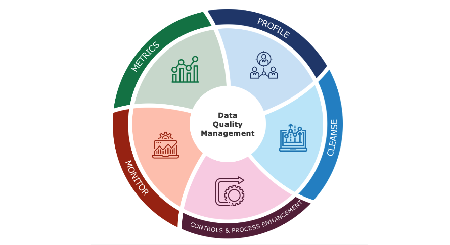

# Data Reliability

Data reliability is a critical aspect that should be intentionally built into every level of the organization, encompassing processes, technologies, communication, and issue triage. It plays a pivotal role in ensuring that the data used for decision-making is trustworthy and accurate.

## Importance of Reliability for Business Decisions

Reliability is key for businesses to make informed and confident decisions based on data. When data is reliable, decision-makers can have the assurance that the information they are using is dependable, consistent, and free from errors or biases. This, in turn, leads to better strategic planning, efficient operations, and improved overall performance.

## Reliability as a Consequence of Quality

Reliability is closely intertwined with data quality. High-quality data is characterized by accuracy, completeness, consistency, and timeliness. By adhering to strict data quality standards and practices, organizations can enhance the reliability of their data assets.

In the context of data reliability and quality, some key considerations include:

1. **Data Collection Processes:**

2. **Data Storage and Management:**

3. **Data Cleaning and Validation:**

4. **Data Governance:** 

5. **Data Security:**

6. **Data Communication:**

7. **Issue Triage and Resolution:**

## Why should we care about Data Quality

## Garbage in is Garbage out

Organizations ingest data from both internal and external, third-party sources depending on the needs of the business

These sources usually **do not have any incentive** to clean and standardize the data they produce

## Continuous improvement process

