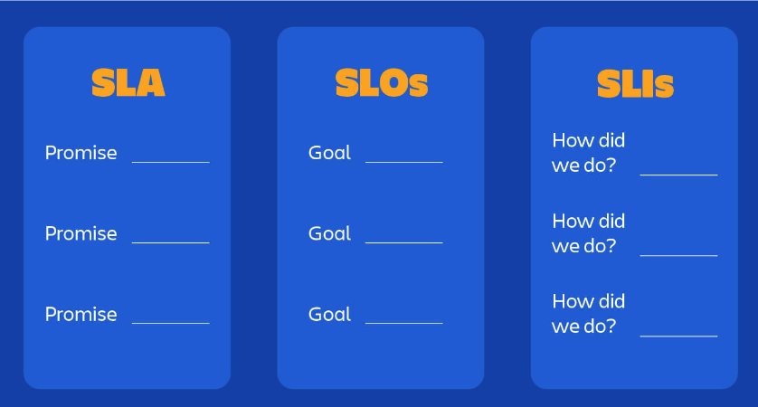

# Data Quality

Data quality rules are guidelines or criteria that define the standards and requirements for ensuring the accuracy, completeness, consistency, and integrity of data. Here is a list of commonly used data quality rules:

## 1. **Accuracy Rule:** 
Data should be accurate and free from errors, ensuring that it reflects the true values or characteristics it represents. 
Techniques to tackle Accuracy related issues:
- Can use views to filter out rows that have quality issues or use group by clause.
- Consider to filter out both Null(absence of data) and Blank(empty string).

## 2. **Consistency Rule:** 
Data should be consistent across different sources and within the same dataset. Consistency rules check for logical and semantic integrity, ensuring that data conforms to predefined standards or business rules.
Techniques to tackle Consistency related issues:
- Consistency issues occurs often due to duplicates. Avoid duplicates in intermediate steps whenever possible.
- Perform count and distinct count to detect duplicate values.
- Perform group by and any group contains more than one row to detect duplicate values.

## 3. **Completeness Rule:** 
Data should be complete, meaning all required fields are populated, and there are no missing values.
Techniques to tackle Completeness related issues:
- Identify any missing values and either filter out or replace them with something reasonable. (Eg. Use NULLIF, COUNTIF, COALESCE etc to filter missing values out of calculations)
- Implement backfilling (automatic process of detecting data drops and requesting data items to fill in the gaps)
- When loading data, verify file integrity with checksum values, hash and MD5

## 4. **Uniqueness Rule:** 
Each record or data instance should be unique within a dataset, ensuring that there are no duplicate entries.
Techniques to tackle Uniqueness related issues:
- Try using surrogate keys and unique constraints to remove duplicate records. 

## 5. **Validity Rule:** 
Data should adhere to predefined formats, data types, and ranges. Validity rules ensure that data is within the expected boundaries and meets the specified criteria.
Techniques to tackle Validity related issues:
- Ensure to check Data type of columns before inserting the data into final table.
- DQ rules to check for variety of sample ranges.
- Unit test cases to check against collective sample records.

## 6. **Integrity Rule:** 
Data should maintain referential integrity, ensuring that relationships between different data elements are preserved and consistent.
Techniques to tackle Validity related issues:
- Primary key constraints, foreign key constraints, unique constraints, and check constraints can be defined to prevent data inconsistencies and violations.
- Conduct data profiling to analyze the quality of data and identify integrity rule violations.