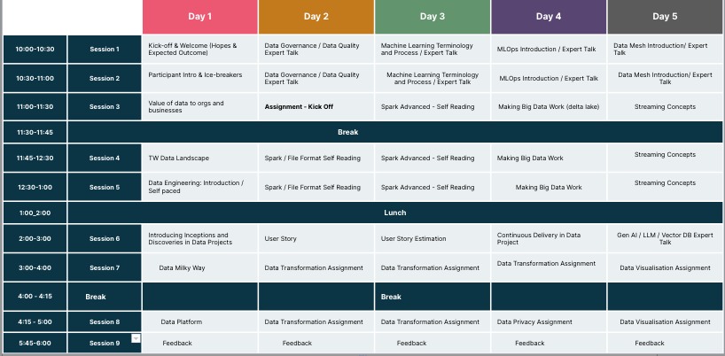

## Data Engineering 🔮

- What is Data Engineering ? 
- The Art of Data Engineering: Crafting Robust and Scalable Solutions
- Data Ingestion
- Data Transformation
- Data Quality

## Data Visualization 📊

- Visualizing Data: From Basic Charts to Interactive Dashboards(streamlit)

## Data Mesh 🕸

- Data Mesh: An Agile and Decentralized Approach to Data Architecture

## Data Analysis 💼

- Data Analysis with OpenAI Demo: Generating Queries for Passing Column Fields to LLM Model

